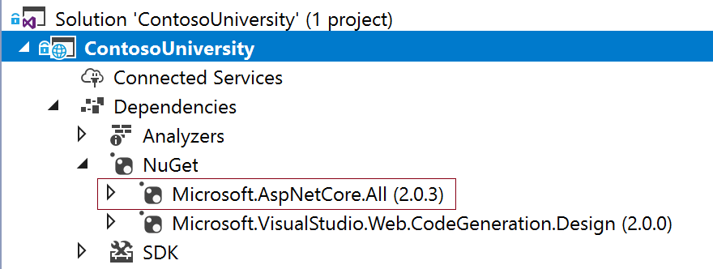
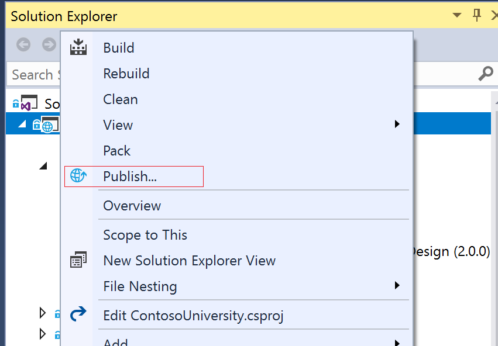
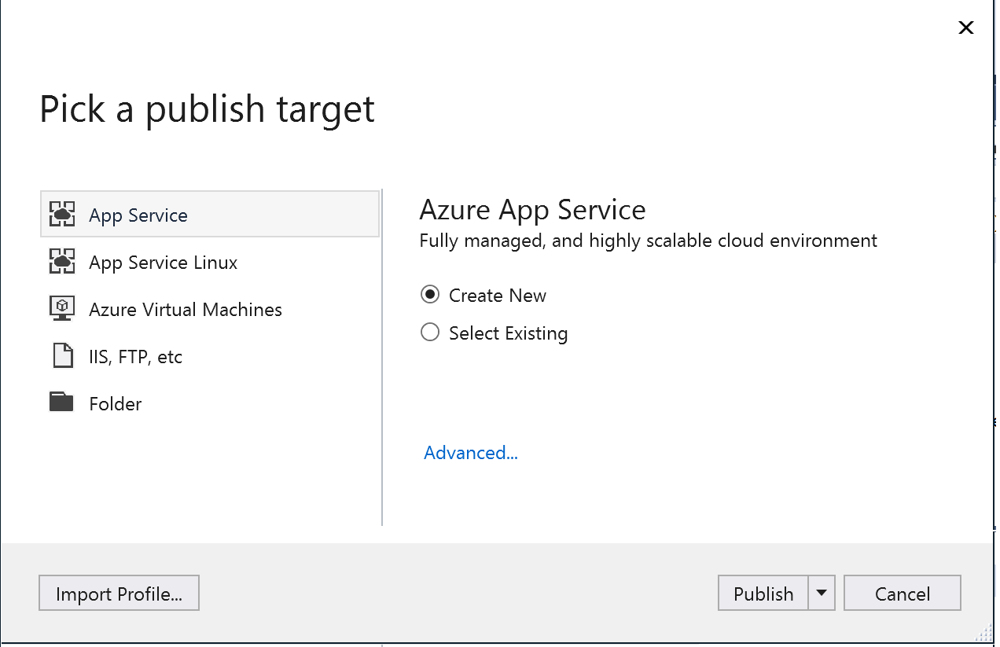
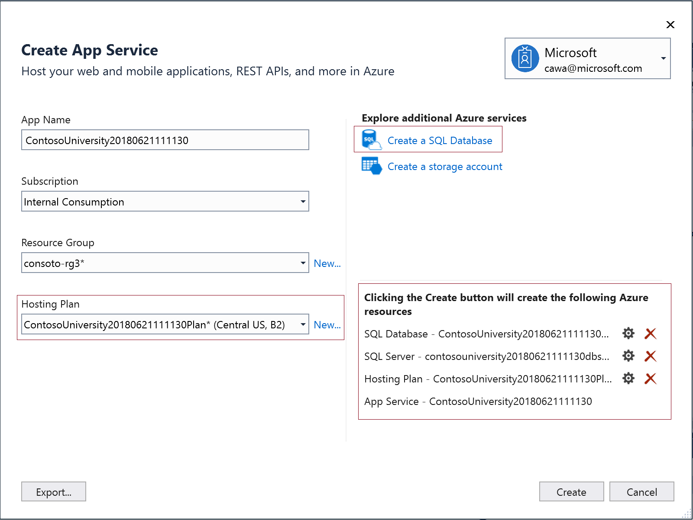
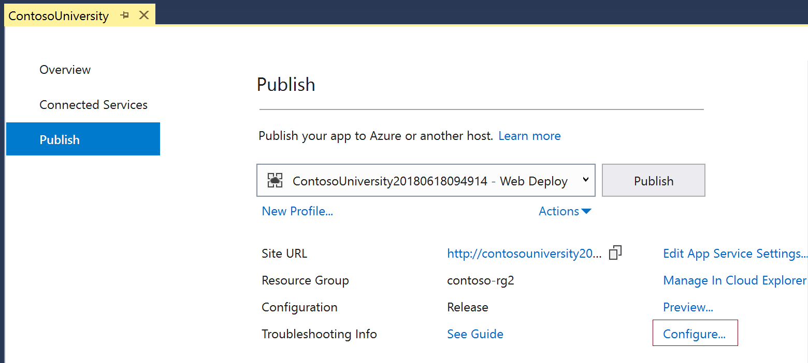
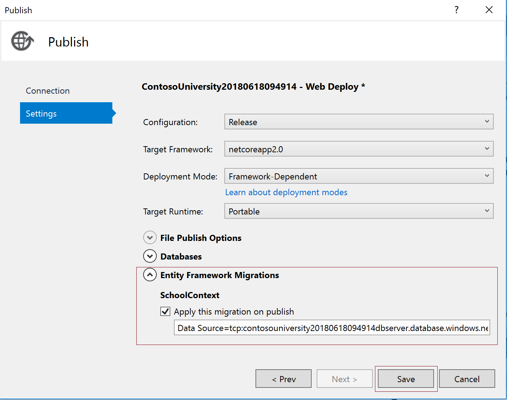

# Contoso University sample app

Contoso University demonstrates how to use Entity Framework Core in an
ASP.NET Core MVC web application.

## Deploy to Azure
Before deploying to Azure make sure you have *Microsoft.AspNetCore.All* nuget package set to version 2.0.3 or later to work with Application Insights. You can do this via NuGet Package Manager interface.

### Publish the web app to Azure
1. Right click on the project to launch Publish dialog

2. Choose create new app service

Make sure the following are set correctly:
* App Services plan is set to Basic 2 or above. This means the web app has at least 3.5GB memory which is required by Snapshot Debugger
* Create a SQL database

You should have the list of resources to be created similar to the screenshot below.

Click *Create* button and wait for the web app to be published.

The web pages that require connection to databases will not work immediately. You need to configure Entity Framework migration on the new Database to finish publishing the web app.

### Entity Framework migration

3. Navigate to *Publish* tab and click *Configure*

4. In *Settings* tab check *Apply this migration on publish* under *Entity Framework Migrations | SchoolContext*. Click *Save* button.

5. Publish you app again. Then clck on another tab, such as *Courses* to make sure entity framwork migration worked.

## Build it from scratch

You can build the application by following the steps in [a series of tutorials](https://docs.microsoft.com/aspnet/core/data/ef-mvc/intro).

## Download it

Download the [completed project](https://github.com/aspnet/Docs/tree/master/aspnetcore/data/ef-mvc/intro/samples/cu-final) from GitHub by downloading or cloning the [aspnet/Docs repository](https://github.com/aspnet/Docs) and navigating to `aspnetcore\data\ef-mvc\intro\samples\cu-final` in your local file system.  After downloading the project, create the database by entering `dotnet ef database update` at a command-line prompt. As an alternative you can use **Package Manager Console** -- for more information, see [Command-line interface (CLI) vs. Package Manager Console (PMC)](https://docs.microsoft.com/aspnet/core/data/ef-mvc/migrations#command-line-interface-cli-vs-package-manager-console-pmc).
